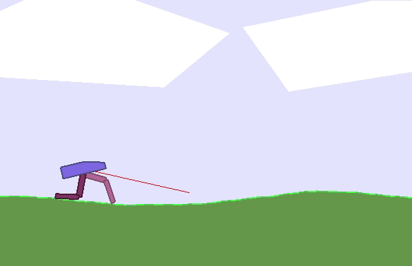

# Learning a Robot to Walk on Two Legs Using Evolutionary Robotics
This repo contains the code for the assignment for the course: Bio-Inspired Intelligence and Learning for Aerospace Applications.

#
The following dependencies have to be installed:
- numpy
- pickle
- matplotlib
- gym
- python-graphviz

 

 

